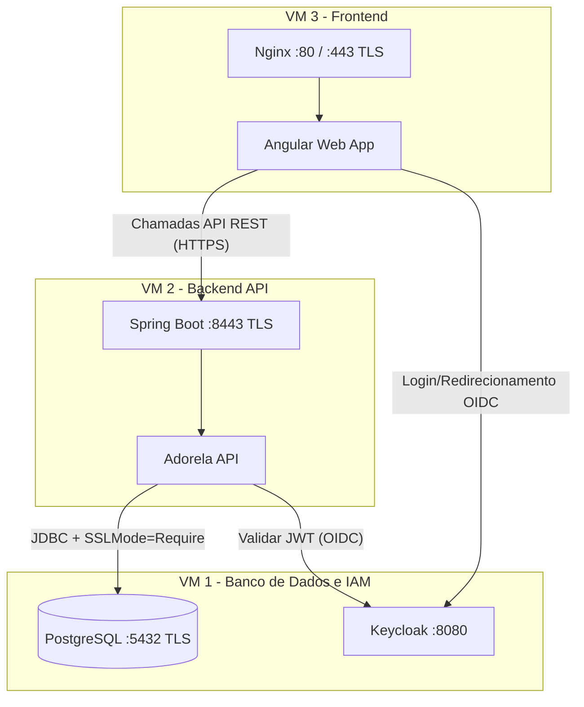

# Arquitetura de Implantação (3 VMs)

O diagrama abaixo ilustra a arquitetura distribuída do projeto Adorela, separando os serviços de Banco de Dados, Backend API e Frontend Web.

## Descrição dos Componentes

- **VM 1:** Hospeda o banco de dados principal (PostgreSQL) com criptografia TLS ativada, e o Identity Provider (Keycloak) responsável pela autenticação via OAuth2/OIDC.
- **VM 2:** Executa a aplicação backend construída em Spring Boot. A API se comunica de forma segura com o PostgreSQL e valida os JWTs emitidos pelo Keycloak.
- **VM 3:** Serve os arquivos estáticos do frontend Angular através de um servidor Nginx, configurado com redirecionamento de HTTP para HTTPS, políticas de HSTS e certificados TLS.
